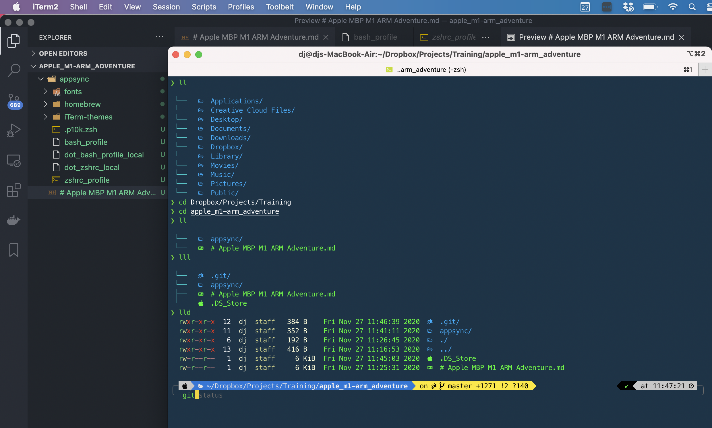

# Apple MBP M1 ARM Adventure

Here is a really slick website that list apps and their compatibility with the new Apple Silicon. https://isapplesiliconready.com

## Apps via Apple Store 
What I have installed and tested. 
- Chrome (native)
- Slack 
- Lastpass
- Grammarly 
- Viscosity 
- Bartender 4
- Calendar 366 (universal binary)
- iStats Menu
- The Clock
- iTerm2 (universal binary)
- Dropbox 
- Evernote

## Homebrew 
Homebrew is a fantastic utility with a variety of great packages for more advanced Mac users and those accustomed to the command line.

To use it, you can choose between:

1. [Running your Terminal from Rosetta 2](https://osxdaily.com/2020/11/18/how-run-homebrew-x86-terminal-apple-silicon-mac/)

2. [Running arch -x86_64 brew instead of brew](https://soffes.blog/homebrew-on-apple-silicon) 

The second link is the great source of info.  I chose to use the second approach. 

This will setup Homebrew in `/usr/local`. Now whenever you want to interact with it, you can run  `arch -x86_64 brew` before any command. This command is the standard installer from brew.sh with the Rosetta prefix. 

`arch -x86_64 brew install htop`

You can also have multiple Homebrew installs; one for native and one for x86.  I also did this.   

### Multiple Homebrew locations 
1. Apple Silicon Native `/opt/homebrew`
2. x86 `/usr/local` 

**Example**
Different apps in different brews.  I use an alias in my `.bash_profile` to map ibrew to the x86 Homebrew. 

```
# Apple Native 
❯ brew list
autoconf	libtool		openssl@1.1	readline
automake	libyaml		pcre		ruby
hstr		ncurses		pkg-config	zsh

# x86
❯ ibrew list
htop		ncurses		prettyping
iterm2
```

Some additional helpful links

- [Compatibility List of core formulae formulae related to native ARM Homebrew installations on macOS 11.0 (Big Sur)](https://github.com/Homebrew/brew/issues/7857)
- [notion.so](https://bit.ly/2V01mxy)
- [apple.stackexchange.com](https://bit.ly/37kRpAT)

### My Homebrew Apps Experience
**Working**
- zsh (native)
- hstr (native)
- prettyping (native)
- ruby (native)
- rbenv (native)
- htop (x86)

**Broken**
- ls-go 
- pyenv (installs but subsequent `python install {version}` fails)

# dot profiles 
I want the same user experience between all my different machines so I sync my dot profiles using Dropbox.  The dot files in the local directory or each device points to another file in a folder called `appsync` in Dropbox.  

I've included all the working files I used for this process in this repo. 

>***WARNING***:
Ordering of commands in the dot files are incredibly important.  If they are out of order you will end up with a crazy assortment of errors and issues.  

## local dot files
This is what each file looks like in the home directory of each machine.  I also keep a copy of these in `Dropbox/appsync` for reference and backup. 

`.bash_profile` 
```
DROPBOX_RC="Dropbox/appsync/bash_profile"
if [ -f $DROPBOX_RC ];
then
    source $DROPBOX_RC
fi
```

`.zshrc`
```
ZSHRC_RC="Dropbox/appsync/zshrc_profile"
if [ -f $ZSHRC_RC ];
then
   source $ZSHRC_RC
fi
```

There are a ton of alternatives ways.  Check out https://dotfiles.github.io/

## zsh 
Apple now defaults to zsh but I prefer to install zsh using homebrew so I can update without messing with the OSX default. 
```
> zsh --version

zsh 5.8 (arm-apple-darwin20.1.0)
```

Install zsh
```
>brew install zsh
```

```
> which zsh
/opt/homebrew/bin/zsh << Apple Silicon Native via Homebrew
```

```
> dscl . -read /Users/$USER UserShell

UserShell: /bin/zsh
```
*Need to update dscl to point to the native homebrew version*

```
sudo dscl . -create /Users/$USER UserShell /opt/homebrew/bin/zsh
```
quit and restart terminal 
*verify*
```
> which zsh
/opt/homebrew/bin/zsh

> zsh --version
zsh 5.8 (arm-apple-darwin20.1.0)

> echo $SHELL
/opt/homebrew/bin/zsh << Notice the change to homebrew directory
```

### Install and setup oh-my-zsh
```
sh -c "$(curl -fsSL https://raw.githubusercontent.com/ohmyzsh/ohmyzsh/master/tools/install.sh)"
```
```
chmod 755 /usr/local/share/zsh
chmod 755 /usr/local/share/zsh/site-functions
```
Install powerlevel10k
```
git clone --depth=1 https://github.com/romkatv/powerlevel10k.git ${ZSH_CUSTOM:-$HOME/.oh-my-zsh/custom}/themes/powerlevel10k\
```

### p10k configuration wizard
After this I restart terminal and run the p10k configuration wizard to install fonts and get any dependencies installed. 

When the p10k wizard finishes it creates `.p10k.zsh` in your home directory.  I want to share my settings between multiple machines so I delete this file and replace it with a symbolic link to this file in Dropbox. 

```
rm .p10k.zsh
ln -s /Users/dj/Dropbox/appsync/.p10k.zsh ~/.p10k.zsh
```
You will need to restart terminal. 

### Fonts and plugins

Install any fonts and plugins. 

```
git clone https://github.com/zsh-users/zsh-syntax-highlighting.git ${ZSH_CUSTOM:-~/.oh-my-zsh/custom}/plugins/zsh-syntax-highlighting\
```
```
git clone https://github.com/zsh-users/zsh-autosuggestions ${ZSH_CUSTOM:-~/.oh-my-zsh/custom}/plugins/zsh-autosuggestions\
```
>***NOTE:*** 
To reflect every change you make use `source ~/.zshrc`

## terminal enhancements 
I wanted to have my terminal colorized and include icons.  Previously I used `ls-go` but that wasn't working because of Go.  Instead I decided to take the [colorls](https://github.com/athityakumar/colorls) approach. 

First is to install Ruby with Homebrew.  You can verify the system default of `/usr/bin/ruby`
``` 
> which ruby 
/usr/bin/ruby
```
Install and setup ruby for colorls 
```
brew install ruby
```
Add path to `.zshrc`
```diff
# Path to your oh-my-zsh installation.
export ZSH=$HOME/.oh-my-zsh
+ export PATH=$PATH:$(ruby -e 'puts Gem.bindir')
```
Add path to `.bash_profile`
```diff
# more homebrew for apple silicon stuff 
export PATH="/opt/homebrew/bin:/usr/local/bin:$PATH"
+export PATH="/opt/homebrew/opt/ruby/bin:$PATH"
```
Restart terminal or open a new tab to verify it's using brew 
```
❯ which ruby
/opt/homebrew/opt/ruby/bin/ruby
```
### Install `colorls`
```
gem install colorls
```
Verify it's using brew and native arm
```
❯ gem which colorls
/opt/homebrew/lib/ruby/gems/2.7.0/gems/colorls-1.4.2/lib/colorls.rb
```
The end result looks like this. 


